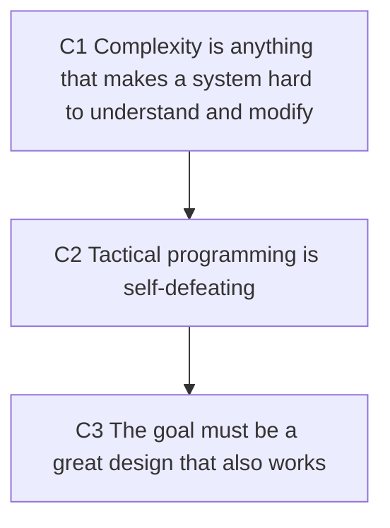

# Example — `argue`

**Situation**: an argument-dense chapter, where every section is part of one chain of conclusions. Slot schema in [cores/argue.md](../cores/argue.md). Material: your own notes on *A Philosophy of Software Design*.

## It looks like this

The skeleton opens the core — the whole chain on one screen, so the reader chooses where to descend:



Then one block per argument. A real one, trimmed:

````md
## Argument 2: tactical programming is self-defeating

- §: §Tactical programming | type: cost argument
- **C**: Tactical programming is self-defeating — it optimises each change while destroying the
  design that makes later changes cheap.
- G:
  - G1 [verbatim · target's position] (〈A Philosophy of Software Design〉§Tactical programming):
    > In the tactical approach, your main focus is to get something working, such as a new feature
    > or a bug fix.
  - G2 [verbatim · the consequence] (〈A Philosophy of Software Design〉§Tactical programming):
    > However, tactical programming makes it nearly impossible to produce a good system design.
  - G3 [paraphrase · the prescription] (〈A Philosophy of Software Design〉§Strategic programming):
    the book's alternative is that the primary goal must be a great design which also happens to work.
- **W**:
  - W1 [reconstruction]: the book's three symptoms of complexity are all about modification — change
    amplification, cognitive load, unknown unknowns — so "no good design" is the mechanism behind
    the cost, not a separate complaint.
  - W2 [mine]: that the cost *compounds* faster than the local gains, i.e. that the two are not
    merely opposed but net-negative over time. The book says design becomes near-impossible; it
    does not compare growth rates.
    > [!warning] My own addition
    > W2 is mine; claimed in Open questions.
- **I**: G1 fixes the objective (get this change working), G2 says that objective destroys the design,
  W1 makes design load-bearing for every later change → the objective is self-undermining → C.
  G3 states the book's alternative but carries no support for C.
- **S**: G1 + G2 joint (bridged by W1) ⇒ C. G3 is the prescription — inert as support.
- **R**: if design damage were locally repayable — one refactor restoring the previous change rate at
  no functional cost — then C weakens from "self-defeating" to "expensive".
````

## Tricks used here

| What you're showing | Use |
|---|---|
| the chapter's whole chain | `flowchart TD`, nodes labelled `C1…Cn` — not buried in prose |
| which part of a quote you elided | `…` in the span; record `elisions` in Quote check |
| whether a sentence is the book's or yours | `[verbatim]` / `[paraphrase]`, plus `[stated]` / `[reconstruction]` / `[mine]` |
| your own step, where the source is silent | `> [!warning] My own addition` at the point of use + claim it in Open questions |
| which grounds actually carry the argument | `S` with `+` (joint) / `;` (independent), naming the inert ones |
| a conclusion weaker than it looks | keep the restraint in **C** ("has no warrant" ≠ "is false") — that is the finding, not hedging |
| where to check a quote | first 8 characters of the sentence, searchable in any reader |

## Variants (same core, different material)

| Material | What changes |
|---|---|
| one long chain across the chapter | the Skeleton *is* the map; one block per step; `S` is usually joint across blocks |
| several short independent arguments | each block is 3-5 lines; `S` is usually `;` independent |
| no quotable lines, only paraphrase | every `G` is `[paraphrase]`, no `>` blocks; Quote check says `(no verbatim quotes)` |
| a conclusion deliberately weaker than it looks | keep the qualifier in **C**, put the conceding condition in **R** |
| verbatim and paraphrase mixed in one argument | fine — tag each `G` separately; only `[verbatim]` reaches Quote check |

## Anti-patterns

**① Splice.** Joining two passages that are far apart without an `…`, so the quote reads as one sentence:

```md
> Complexity is incremental — no matter how much you invest up front, there will inevitably be mistakes.
```

Constructed from two separate paragraphs. Caught by whole-span verification → `⚠ splice`. Fix: add `…`, or split into two grounds.

**② Framing inside the quote.** Putting your own lead-in inside the `>` block:

```md
> The book's key point: "Working code isn't enough."
```

`The book's key point:` is not the author's words. Fix: move it to the ground's label — `[verbatim · the prescription]`.

**③ Rewritten quote marks.** Rewriting `“…”` as `'…'` so quotes nest inside a quote block. It is a transcription change, the check flags `⚠ not found`, and it is the defect most likely to survive review because it looks tidier. Fix: keep the source's punctuation as printed.

**④ Tag and warning disagreeing.** A ground tagged `[reconstruction]` carrying a `> [!warning] My own addition`. Only `[mine]` gets the warning block; `[reconstruction]` is claimed in Open questions like any other open bet.

## CJK sources — the traps that only exist in Chinese text

These are the real defects that verification caught in this vault's first Chinese page, kept here because they have no English analogue:

- **Quote-mark rewriting** — the source printed `“重心”`; the draft wrote `'重心'`. Reported `⚠ not found`, because *punctuation is never normalized*. If it were a `「」`-style source, the same rule applies.
- **A source-internal ellipsis is not an elision** — `“免于……的自由”` verifies as a whole span with `elisions 0`; only *your* elisions get counted.
- **Full-width vs half-width** — the one normalization allowed. Whitespace and width only; never wording.
- **`——` is not `……`** — a draft joined two distant sentences with an em-dash and no elision marker. Same class as anti-pattern ①, and the reason the whole-span check runs before any splitting.
