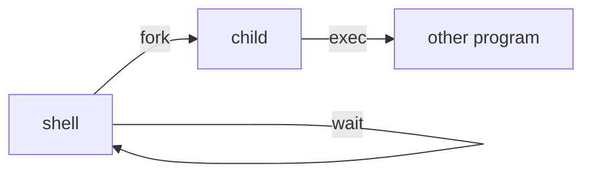

# Example — `explain`

**Situation**: a mechanism chapter — how something works, and when it breaks. Slot schema in [cores/explain.md](../cores/explain.md). Material: your own Xv6 notes.

## It looks like this

````md
## Skeleton


## What it solves
The kernel offers two orthogonal primitives: `fork` copies the current process, `exec` overwrites the
current process with a new program. Neither alone is "start a program" — the split is the design, and
it is what leaves room for the shell to alter the environment in between.

## Mechanism
1. `fork` copies the calling process's memory contents and open files. The parent and child have the
   same memory contents but separate address spaces; the return value identifies which is which —
   the parent receives the child's PID, the child receives zero.
2. `exec` does not return on success. It replaces the process image and execution starts at the entry
   point declared in the ELF header.
3. Key invariant: after `fork` there is one program in two processes; after `exec` there is one
   process running another program.

## Code
```c
// shell: run the command in a child, parent waits
if (fork1() == 0)
    runcmd(parsecmd(buf));
wait(0);
```
Source: 〈Xv6〉§1.1 (code as printed in the book)

## Trade-offs
| scenario | benefit | cost | when not to use |
|---|---|---|---|
| `fork` then `exec` | the shell can change the environment between the two steps (cwd, redirection, fds) | one extra copy of the address space | when nothing needs changing in between |
| calling `chdir` in the child | — | the change does not affect the shell itself | never: `chdir` must be called by the parent |
| `exec` to start a program | same process, new program — no process structure to rebuild | success means no return, so cleanup must move earlier | when you must come back to the original program if it fails (fork first) |
````

## Tricks used here

| What you're showing | Use |
|---|---|
| call order and roles | `flowchart LR`, edge labels as the action (`-- fork -->`) |
| memory / data-structure layout | can't be drawn — use prose + `see figure n-m in the book`, or embed the PDF page per [DISPLAY](../DISPLAY.md) |
| where code came from | fence with the language + listing number or `path:line`; say whether it is as printed or edited |
| "when not to use" | the trade-off table must have that column; a table of benefits is marketing |
| version-sensitive facts | attach the edition or date in the sentence (API names, defaults, benchmark numbers rot fastest) |
| several interacting mechanisms | one `## Mechanism` each; the interaction goes in `## Skeleton` |

## Variants

| Material | What changes |
|---|---|
| the chapter prints code | `## Code` + provenance, language-tagged |
| a purely conceptual mechanism, no code | omit `## Code` entirely (no empty heading); mechanism + diagram + trade-offs is the whole page |
| a figure mermaid cannot draw (photo, hand-drawn architecture, screenshot) | prose description + `see figure n-m`; for a PDF source embed the original page; a human-supplied image goes to `wiki/assets/` |
| the mechanism is a set of constraints, not a flow | replace the diagram with a state table or inequalities — don't force a `flowchart` |
| one mechanism spanning several sections | one `## Mechanism` per mechanism, interaction back in `## Skeleton` |

## Anti-patterns

**① Code with no provenance.** A C excerpt with no listing number, no file, no indication of whether it was edited. Within a year you cannot tell whether it still matches your copy. Fix: `Source: 〈Xv6〉§1.1 (code as printed in the book)`; if edited, say what was removed.

**② Forcing mermaid onto non-diagram material.** Pushing "memory layout" or "stack frame" into a `flowchart` yields boxes pointing at each other that explain less than the book's figure did. Fix: describe it in prose, cite `see figure n-m`, and state plainly that this page has no diagram.

**③ Mechanism written as a table of contents.** `## Mechanism` rendered as "1. processes 2. memory 3. files". The only test is whether a reader can re-derive the behaviour from that section alone. If not, no mechanism was written.

**④ Padding an empty slot.** The chapter offers no trade-off material, so three lines of "pros / cons" get invented. Per [SPINE](../SPINE.md)#Empty-slots: omit the slot; only `### §n` and `## Quote check` are unconditional.
