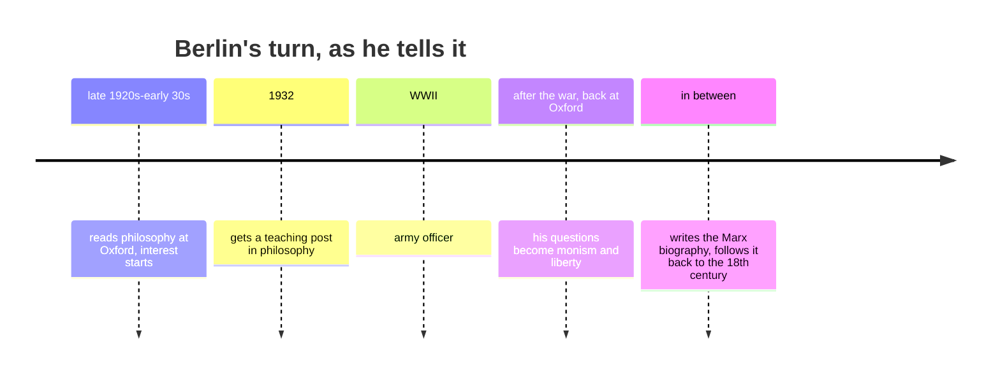
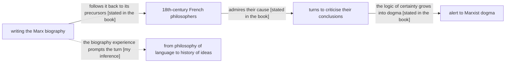

# Example — `trace`

**Situation**: a historical or biographical chapter — who did what, in what order, and what the book claims caused what. Slot schema in [cores/trace.md](../cores/trace.md).

Material below is Berlin's account of his own turn (from 〈我的学术之路〉§3/§5/§9), rendered in English because this sample page is written as if for an English book. See the note at the end on section titles.

## It looks like this

````md
## Skeleton


## Timeline
See skeleton — the book gives order but few precise dates, and the page should not invent them.

## Positions
| person | position | opposed by | source |
|---|---|---|---|
| Vico | stones are explained, people must be understood; the questions themselves shift between cultures | universal-truth natural law | §5 |
| Herder | every culture has its own centre of gravity | the French Enlightenment's universal truth; his teacher Hamann objected even earlier | §6 |
| the Encyclopaedists | scientific method is the only road to fundamental truth | Berlin — he admired their cause, attacked their conclusions | §3 |

## Causal chain


## Links to other chapters
§1-§2 are his philosophical starting point; §4 onwards is what he cared about after the war. This
chapter is the book's only first-person chronology.
````

## Tricks used here

| What you're showing | Use |
|---|---|
| order | `timeline`; only when the book gives dates or sequence |
| distribution of positions | a table with fixed columns person / position / opposed by / source |
| causation | `flowchart LR`, **every** edge labelled `[stated in the book]` or `[my inference]` |
| your own inference | dashed edges (`-.->`) so they are visually separable from the book's claims |
| checkability | every table row carries a `§`, never memory |
| attribution | *position* is what the chapter presents, even when Berlin is attacking it |

## Variants

| Material | What changes |
|---|---|
| the book gives dates or order | `## Timeline` as mermaid `timeline`, one event per line |
| no dates, only disagreement | drop `## Timeline`; Positions + Causal chain are the whole page |
| many people, heavy cross-referencing | split: this chapter's positions table + links to `wiki/persons/`; never mix biography into the position column |
| causation is mostly your inference | every edge dashed, every one claimed in Open questions |
| the chapter is only a historical lead-in to an argument | don't declare `trace` — open a section inside the `argue` page |

## Anti-patterns

**① Sequence read as causation.** Two events adjacent on a timeline get joined by a causal edge. If the book only says "after this, I began to criticise", there is order but no asserted cause: either omit the edge, or make it dashed and tag it `[my inference]` and claim it in Open questions. This is the core's most likely error, because narrative supplies causation for free.

**② Back-filling a motive.** Berlin writes "perhaps it is a matter of temperament; I simply do not believe it". Rewriting that as "he came to doubt monism because of his early experience" replaces the book's stated ignorance (it does not claim to know why) with a story. When the source says it does not know, `trace`'s job is to record the not-knowing.

**③ Positions column written as biography.** Three paragraphs of life story under "position". The column needs one sentence, enough to place the person against the others; lineage and dates belong in `wiki/persons/`.

**④ Competing with `argue` for the same material.** A chapter that is a historical opening plus an argumentative body should declare `argue` and keep a `trace` section inside it. Declaring both spreads the same material over two slot sets that then drift apart.

## On section titles in a Chinese book

The headings in this sample are English because the sample page is for an English book. In a real Chinese page they must be the book's own wording and numerals — `### §5 维柯`, never `### §5 Vico`. Section titles are quoted, not translated: they are the anchor contract, and translating one breaks every link into it ([LANGUAGE](../LANGUAGE.md)).
